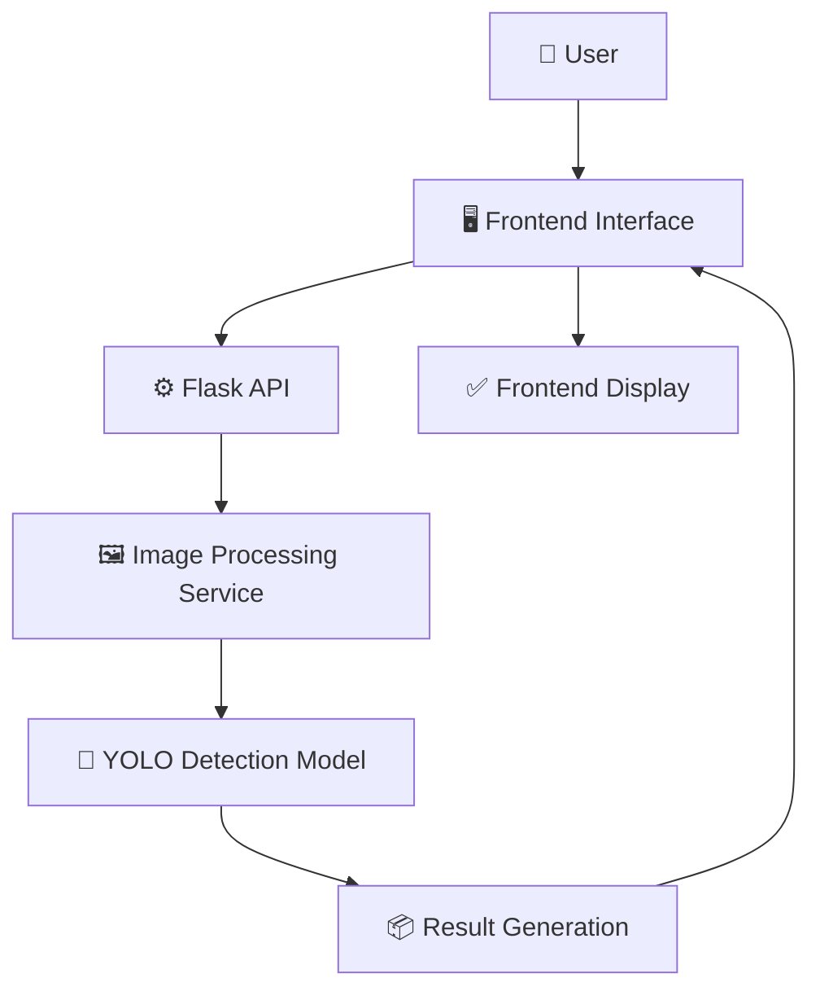

<div align="center">

# 🧠 Face Detection AI Web Application

### Real-Time Human Face Detection Powered by a Custom-Trained YOLO Model

*Detect faces in images and live webcam streams — built end-to-end from raw dataset to deployed inference engine.*


[Overview](#-project-overview) • [How It Works](#-how-it-works) • [Results](#-model-performance) • [Installation](#-installation) • [Usage](#-usage) • [API](#-api-documentation) • [Roadmap](#-roadmap)

</div>

---

## 📌 Project Overview

**Face Detection AI Web Application** is a full-stack computer vision system that detects human faces in real time using a **custom-trained YOLO11n model**. It combines a Flask-powered inference API with a lightweight, responsive frontend to support both **image uploads** and **live webcam detection**.

This project was built to demonstrate a complete, production-style ML pipeline — from raw annotated data to a deployable web application — rather than relying on a pre-built detection API.

> 🎯 **Goal:** Build an end-to-end AI system — dataset engineering, model training, evaluation, and deployment — entirely from scratch.

---

## 💡 Project Motivation

Off-the-shelf face detection APIs are easy to plug in but teach you very little about what happens underneath. This project was built to gain hands-on, practical experience with the **entire computer vision lifecycle**:

- Converting raw annotations into a trainable format
- Training and evaluating a real object detection model
- Serving that model through a REST API
- Wiring it up to a usable, interactive frontend

The result is a compact but complete AI engineering portfolio piece.

---

## ✨ Features

| Feature | Description |
|---|---|
| 🎯 Custom-Trained Model | YOLO11n trained from scratch on a hand-prepared face dataset |
| 📷 Image Upload Detection | Upload any image and get faces detected with bounding boxes |
| 🎥 Real-Time Webcam Detection | Frame-by-frame live face detection via webcam |
| 👥 Multi-Face Detection | Detects multiple faces in a single frame |
| 📦 Bounding Box Visualization | Clean, labeled bounding boxes on all detections |
| 📊 Confidence Scores | Every detection includes a model confidence score |
| 🔌 REST API Architecture | Clean Flask endpoints for image and stream processing |
| 🧩 Modular Backend Design | Services separated for easy maintenance and extension |
| 🔄 Easy Model Replacement | Swap `best.pt` with any updated YOLO checkpoint |

---

## 🛠 How It Works

### Development Journey

**1. Dataset Preparation**
- Source dataset collected from **Kaggle**
- Original annotations in **LabelMe JSON** format, containing face bounding boxes
- Built a custom conversion pipeline: **LabelMe JSON → YOLO annotation format**
- Automated dataset split:

| Split | Percentage |
|---|---|
| Training | 70% |
| Validation | 20% |
| Testing | 10% |

```
dataset/
│
├── images/
│   ├── train/
│   ├── val/
│   └── test/
│
└── labels/
    ├── train/
    ├── val/
    └── test/
```

**2. Model Development**

Trained using the **Ultralytics YOLO** framework.

| Parameter | Value |
|---|---|
| Model | YOLO11n |
| Classes | 1 (`face`) |
| Image Size | 640 × 640 |
| Epochs | 50 |
| Dataset Size | 300 images |
| Framework | Ultralytics YOLO |

**3. AI Inference**

- **Image Detection** — image is uploaded → backend processes it → YOLO detects faces → bounding boxes generated → result returned to frontend
- **Webcam Detection** — live camera frames are captured and processed frame-by-frame, with bounding boxes rendered on detected faces in real time

---

## 📊 Model Performance

The model was evaluated on a held-out validation split after 50 epochs of training.

| Metric | Score | What It Means |
|---|---|---|
| **Precision** | 97.6% | Of all faces the model predicted, 97.6% were correct — very few false positives |
| **Recall** | 93.6% | Of all real faces in the data, the model successfully found 93.6% of them |
| **mAP@50** | 97.5% | Near-perfect detection accuracy when a 50% overlap with the true bounding box is required |
| **mAP@50-95** | 78.3% | Strong performance across stricter overlap thresholds (50%–95%), reflecting precise localization |

<div align="center">

**High precision + high recall at mAP50 indicates the model reliably detects faces with minimal false alarms — a strong result for a single-class detector trained on only 300 images.**

</div>

---

## 🏗 Application Architecture



**Flow:** User → Frontend → Flask API → Image Processing Service → YOLO Detection Model → Result Generation → Frontend Display

---

## ⚙️ Technology Stack

<table>
<tr>
<td valign="top" width="25%">

**Frontend**
- HTML5
- CSS3
- JavaScript

</td>
<td valign="top" width="25%">

**Backend**
- Python
- Flask
- Flask-CORS

</td>
<td valign="top" width="25%">

**AI / Computer Vision**
- Ultralytics YOLO
- OpenCV
- Pillow
- NumPy

</td>
<td valign="top" width="25%">

**Dev Tools**
- VS Code
- Python venv

</td>
</tr>
</table>

---

## 📁 Project Structure

```
face-detection-web-app/
│
├── backend/
│   ├── app.py
│   ├── services/
│   │   └── face_detector.py
│   ├── uploads/
│   └── results/
│
├── frontend/
│   ├── index.html
│   ├── style.css
│   └── script.js
│
├── model/
│   └── best.pt
│
├── dataset/
│
├── training/
│   ├── train.py
│   ├── split_dataset.py
│   └── convert_labelme_to_yolo.py
│
├── requirements.txt
└── README.md
```

---

## 🚀 Installation

**1. Clone the repository**
```bash
git clone https://github.com/your-username/face-detection-web-app.git
cd face-detection-web-app
```

**2. Create a virtual environment**
```bash
python -m venv venv
```

**3. Activate the environment**
```bash
venv\Scripts\activate
```

**4. Install dependencies**
```bash
pip install -r requirements.txt
```

**5. Run the backend**
```bash
python backend/app.py
```

**6. Open the application**

Navigate to the frontend in your browser (e.g. `frontend/index.html` or the URL printed in your terminal).

---

## 🎮 Usage

1. Open the application in your browser
2. Upload an image
3. Click **Detect Face**
4. View the detected result with bounding boxes and confidence scores

---

## 🔌 API Documentation

> Update endpoint names/paths to match your actual `app.py` routes.

| Endpoint | Method | Description |
|---|---|---|
| `/api/detect/image` | `POST` | Accepts an uploaded image, returns detections with bounding boxes and confidence scores |
| `/api/detect/webcam` | `POST` | Accepts a single video frame, returns face detections for that frame |
| `/api/health` | `GET` | Health check for the API service |

**Example Request**
```bash
curl -X POST http://localhost:5000/api/detect/image \
  -F "image=@sample.jpg"
```

**Example Response**
```json
{
  "faces_detected": 2,
  "detections": [
    {"bbox": [34, 52, 210, 240], "confidence": 0.97},
    {"bbox": [300, 80, 460, 260], "confidence": 0.94}
  ]
}
```

---

## 🔮 Future Scope

- 📈 Larger and more diverse dataset
- ⬆️ Upgrade to YOLO11s / YOLO11m for improved accuracy
- 👥 Better detection performance in crowded scenes
- 🌐 Browser-based live webcam detection (no local install)
- 🪪 Face recognition integration (identity matching, not just detection)
- 🔐 User authentication
- ☁️ Cloud deployment
- 🗂️ Detection history and logging

---

## 🗺 Roadmap

- [x] Dataset preparation
- [x] Label conversion (LabelMe → YOLO)
- [x] YOLO model training
- [x] Model evaluation and testing
- [x] Image detection API
- [x] Frontend prototype
- [ ] Advanced webcam integration
- [ ] Model optimization
- [ ] Cloud deployment

---

## 👤 Author

**Your Name**
📧 yashtakalkar44@gmail.com
🔗 [LinkedIn](https://www.linkedin.com/in/yash-takalkar-5a364a284/) • [GitHub](https://github.com/Yash-0608) • [Portfolio](https://portfolio-website-one-xi-92.vercel.app/)

---

<div align="center">

### ⭐ If you found this project interesting, consider giving it a star!

*Built with a custom-trained model, not a pre-built API — from raw data to real-time detection.*

</div>
